<picture>
  <source media="(prefers-color-scheme: dark)"  srcset="assets/hero-dark.svg">
  <source media="(prefers-color-scheme: light)" srcset="assets/hero-light.svg">
  
</picture>

  
  

---

### About

I'm a product-minded **UI/UX designer** from Cairo. For three years I've owned full product surfaces end to end — consumer apps, driver and operator apps, marketing sites, e-commerce storefronts and multi-role admin dashboards — from research and user flows through to high-fidelity Figma handoff.

Today I'm the **sole product designer for [Teslm](https://play.google.com/store/apps/details?id=com.teslm)**, a logistics, e-commerce and on-demand food platform in Saudi Arabia, where I design four connected surfaces and maintain the shared component library that keeps them consistent. Before that I was a recurring design partner for Swiss firm **[Somion](https://somion.org/en)**, shipping their internal SaaS suite and 8+ brand and product surfaces.

What changed recently: I stopped handing the Figma file over and started **building the product myself**. Design taste plus a business head, with AI closing the distance between the artboard and the deployed thing.

---

### Toolkit

**Design**

  
  
  
  
  
  

**AI &amp; vibe coding**

  
  
  
  
  

**Build**

  
  
  
  
  
  
  
  

---

### Featured work

**Shipped products** — designed end to end

| Product | My role | Live |
| :-- | :-- | :-- |
| **Teslm** — consumer app unifying e-commerce and on-demand food ordering | Sole product designer | [Google Play](https://play.google.com/store/apps/details?id=com.teslm) |
| **Teslm** — rider/driver app, operations dashboard and storefront | Sole product designer | [teslm.shop](https://teslm.shop) |
| **Somion** — marketing site and internal SaaS suite (task manager, HR, sales CRM, file manager) | Design partner | [somion.org](https://somion.org/en) |

**Designed and built with AI** — my own products, shipped

| Project | What it is | Live |
| :-- | :-- | :-- |
| **Itqan** · إتقان | Qur'an spaced-repetition system. SM-2 algorithm adapted for memorization with length-aware daily caps. Next.js 16, React 19, TypeScript. | [itqan-azure.vercel.app](https://itqan-azure.vercel.app) |
| **Quran Center** | Memorization-centre platform — Flutter mobile app, Next.js super-admin dashboard, Supabase backend. | [quran-web-sage.vercel.app](https://quran-web-sage.vercel.app) |
| **Somion HR Payroll** | End-to-end payroll workflow with HR / Admin / Finance roles, batched approvals and a per-employee state machine. Next.js 15. | [repo](https://github.com/YossefElfeel/somion-hr-payroll) · [demo](https://somion-hr-payroll.vercel.app) |

**Design portfolio** — [Figma](https://www.figma.com/design/Ck1QBlVLSMSvrc06E6EhYL/Yossef-Elfeel-ui-ux-designer--Portfolio-File?node-id=19-218784) · [Behance](https://www.behance.net/yossefelfeel)

---

### GitHub

  
  

  

<picture>
  <source media="(prefers-color-scheme: dark)"  srcset="https://raw.githubusercontent.com/YossefElfeel/YossefElfeel/output/snake-dark.svg">
  <source media="(prefers-color-scheme: light)" srcset="https://raw.githubusercontent.com/YossefElfeel/YossefElfeel/output/snake.svg">
  
</picture>

---

### Connect

  
  
  
  
  
  
  

